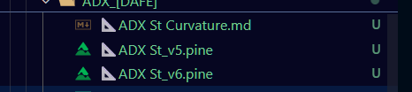

# Pine Script Quantitative Repository

A comprehensive collection of reverse-engineered Pine Script indicators and strategies, converted from TradingView to a structured library format.

## Project Governance

**Project Overseer**: Kilo (AI Assistant)
- **Authority**: Task-based only
- **Scope**: Overseer has authority ONLY when explicitly assigned a task
- **Duration**: Authority begins with task assignment, ends with task completion
- **Role**: Execute assigned tasks, provide technical guidance, maintain repository structure

### Commit & Push Policy

⚠️ **CRITICAL**: Physical proofreading of all commits is required before pushing.
- Large batch commits require pre-commit review and possible extension requests
- Batch organization tools must be in place before bulk operations
- No commits/pushes without physical verification capability
- Systematic approach required to prevent overwhelming review burden

## Overview

This repository contains 100+ Pine Script indicators and strategies organized into a modular library structure. Originally developed on TradingView, these scripts have been converted and organized for research, analysis, and educational purposes.

## Repository Structure

```
Model Indicators/
├── Dskyz[Dafe]_collective/     # Premium indicators from Dskyz/Dafe
│   ├── Indicators/             # Individual trading indicators
│   └── Strategies/             # Complete trading strategies
├── quantitative/
│   ├── libraries/              # Categorized indicator library
│   │   ├── filters/           # Signal filtering indicators
│   │   ├── momentum/          # Momentum oscillators
│   │   ├── trends_FIR/        # FIR trend indicators
│   │   ├── trends_IIR/        # IIR trend indicators
│   │   ├── volatility/        # Volatility measures
│   │   ├── volume/            # Volume-based indicators
│   │   └── [other categories]/
│   └── core/                  # Core price calculations
└── [legacy scripts]/           # Original TradingView scripts
```

## Key Features

- **100+ Converted Indicators**: Comprehensive library of technical analysis tools
- **Categorized Organization**: Logical grouping by indicator type and function
- **Premium Dskyz/Dafe Collection**: Exclusive indicators from top Pine Script developer
- **Complete Strategies**: Full trading systems with entry/exit logic
- **Well-Documented**: Each indicator includes usage notes and parameter descriptions

## Categories

### Core Libraries
- **Filters**: Band-pass, Kalman, wavelet, and smoothing filters
- **Momentum**: RSI, MACD, Stochastic, and custom oscillators
- **Trends**: Moving averages (FIR/IIR), trend direction indicators
- **Volatility**: ATR, Bollinger Bands, historical volatility measures
- **Volume**: OBV, Money Flow, Volume Oscillators
- **Numerics**: Statistical functions, distributions, transforms
- **Cycles**: Hilbert, Fourier, lunar/solar cycle indicators
- **Reversals**: Pivot points, fractals, reversal patterns
- **Statistics**: Correlation, regression, hypothesis tests
- **Forecasts**: Predictive models and ML-based forecasts
- **Dynamics**: ADX, Ichimoku, Alligator, trend strength
- **Errors**: Loss functions and error metrics

### Dskyz/Dafe Collective
Premium indicators including:
- AI Adaptive Regime
- Quasimodo Range Engine
- Volume-Confirmed Reversal Engine
- VIX Engine
- Siege Structure Engine
- Storm Trend ChartPrime
- Open Interest & Liquidation Flow

## Usage

These Pine Script indicators are provided for:
- **Educational purposes**: Study indicator logic and implementation
- **Research**: Analyze technical analysis methodologies
- **Reference**: Compare different approaches to signal generation
- **Strategy development**: Build upon proven indicator concepts

## Important Notes

⚠️ **No Logic Modifications**: The quantitative library scripts are complete and should not be modified. They represent finalized, production-quality code.

⚠️ **Dskyz/Dafe Indicators**: These premium indicators are the work of one of the world's top Pine Script developers. They should be preserved and respected as-is.

## License & Attribution

All scripts converted from TradingView. Original authors retain rights. This repository serves as a preservation and research archive.

## Contributing

When adding new indicators:
1. Maintain existing folder structure
2. Follow naming conventions (version numbers in filenames)
3. Include documentation (.md files) for complex indicators
4. Preserve original logic without modifications
5. Add to appropriate category

## Version History

- **v6.0**: Complete library reorganization, 100+ indicators converted
- **v5.x**: Initial Dskyz/Dafe collection integration
- **Legacy**: Original TradingView script collection   
close > sma 9 and close > 20sma and close > 50sma and close <> 100sma and close <200sma and hma 28  < sma 35 and rsi  <= 45 and 50 < adx < 70  andallmust be true between a 10 bar span  than and only than  fire off long 
close long  when hma25 crossesunder hma25[1] 
as an exreemly rediculous exacmplew

or cN HAVE A SEVERAL SMALL TRADESFIRRING OFF  WITH PRYAMD = 10
LONG 1 = CCI CROSSQ OVER -300
LONG 2 = CCI CROSS OVER - 250
LONG 3 = CCI CROSS OVER - 200
LONG 4 = crsi cross over  lower dynamic band  
long 5 =  vZ tx  crONW LITTLETRADES IN A GREATER STRATEGYoss  67 
ECTSRA EACH ONE ITS  OWN MINI TRADE IN A GREATER STRARTEGY PLAYING OUT ON THE SAME  ASSET
@AGENTS THIS IS THE SKETLETON KEY 
FOLDER  FOUND IN THE LIBRARY IM CRURRENTLY ONT HTE 3RD VERSION IT WORKS AND NEEDS A LONS WAY TO GO. FIRST NEEDING TO FIGURE OUT HOW TO CODE  HIGHLY COMPLEX STRARTEGU=Y MAINTENEANCE AND  EDITABILITY THEN FIGURIING OUT HOW TO MAKE IT RUN TOGRTHER   IN ANY  COMBINATION THAT USER MAY WANT ,  W ESSENTIALLY THIS IS GOING TO  ALERT SYSTEM IS BULT O  THE SAME exact LOGIC  SLMODY THR SAME LAYOUT   JUST  WITH A LOT MORE EDITABILITY, AND   THEN AT THE END AFTER USING THE TOOL TO BACK TEst 2 2the strtagey  forward test , the tool  will have some inte gration that wuld make it a bit more streamlined to setup webhooks so that you may automate the stratagy and  you can test the t=strategy  in  real market, an easy plug and play.. well neasy  wekl that was the firsst visionhen. He continued to go from there and it grew into wanting to have a slew of AI agents that would be working together in teams managed by a few Umm hey I overseers Umm AI teams that would be making strategies AI teams that would be making indicators AI teams that would be curating data AI teams that would be cleaning the data AI teams that would be putting the data together AI teams that would be umm creating strategies AI teams that would be studying quantitative data of strategies of Candlestick charts AI teams that would be able to analyze the clean data and be able to see market temperatures as I would call it I have an idea of being able to collect maybe like 400 different or 300 400 different time frames leaving out and 6 months chunks here and there save for the entire eats lifespan and you want to leave out the trunk square forward testing but just train it on a mess of data and but not this is just one idea and but and take 400 different time frames and uh you would take out the actual price a bit ins to the same size so example you would be able to put the one minute next to the weekly and scale it to the same size so the I guess you would scale it to like index of 100 or something maybe and so that the price range wasn't an actual you know a percentage but the one minute and uh weekly would give like a normalized value and we would couple that with several indicators doing the same the same idea and be able to find fractals and market temperatures this way you know even if it happens on the one minute or the weekly that the bots that we're going to be looking over this data wouldn't know what's what they just know that in this very specific conditions umm this move could fire off and we get expected to last for you know the winning trades last 4 15 bars losing trades last quarter 30 bars be able to adjust that but each all these steps would be governed by a team of agents that would be oversaw by more agents and umm with the quantitative uh dad said you know style in mind Umm alternately I need to trade off of quantitative data not just a Candlestick charts example would be like you know in a move a particular signal averages A 10% move on this time frame with the standard deviation of 5% or something and WD that signal would fire off instead of looking for a umm particular dollar amount move set your take profits for your standard deviations or your you know your medians and your but having AI being able to form you know several it's going to be a whole ecosystem of AI being able to create indicators which indicate is are going to be used to train the agents or going to be the these guys the DAFE and the DSKYZ boulder that's what everyone got a handful of indicators but it is the by far the most complex and advanced pine scripting I've ever seen and I think that it's just by far the most complex indicator creator that this world has right now and so he's got about one indicators that kind of rotate and open source so I'm collecting those and then I have the quantitative folder has like another 250 or so indicators of 250 of like standard indicators but it's rewritten for quantitative trading and so that these indicators have no warm up they don't need to warm up their accurate by like the second bar or so And then I am also trying to gather the umm documents the official uh pine user documents user manual because with that the right now is only the reference manual and the reference manual I think may only cover barely half of what is in the user manual pine script is nothing but honestly very nuanced situations and nuanced synt And there's just so many terms that are just not even close to being covered they just don't have a definition at all in the reference manual in the user manuals covers so much more So umm figuring out a rag system a really good rag system and properly preparing the entire user manual which is going to be yes I think two to three times more information very useful information but it's also going to be two to three maybe four times more lines than a reference manual so that needs be gathered and turn the two mark down and come to find out deepest r RAG system and this the best that's out there as of right now And then I'm also collecting all the best Pine scripting tools that are on Github and all the I think AI tools and I'm trying to find and I'm trying to gather them all into one and figure out how to make it all work together working with copilot and trying to figure it out how to make this one everyone stopped shop for trading automating everything then also building tools offline tools like other strategy builders and I feel like there's so much out there but it's also spread out so thin and there he's not a want of updates for Pine Script version 6 it's all version 5 the I think it's important 6 focused on because at the end of 2024 wheQUANTITATIVE STRIPTSn version six dropped is also win artificial intelligence really started taking up and started really having this exponential growth and so I feel like anything that is you know kind of established that was before version 5 and before November 2024 is kind of just useless


## Major  parts of the end goal

# 📁📁in the model indicators folder📁📁
## 1.📁📜DSkyzinvestments/ Dafe indiCATORS📜📁
## 2.📁📜QUANTITATIVE Scripts📜📁                                    

extreemly hard rule. no llm /agent is to change the logic  of any of the scripts, the ty are not to add noretake away, every script in the quantitative  folder iis dont t and completeded to abosolute perfection.
- i still  have many  dyskyz infdicastors q to add.
-the dskyz aka dafe indicators are also  fukkly compleey in damn well im possible tto im prove   so no agent is to ever tryo to modwify the dsky scripts logic.
-under very specific circumstances  i may have angents help me create  and name folders   fir the dyskyz 
-a mission of  having an angent a a treaem of agnets do a breaoswewr   scra[ing mission on tradong view , need to be broesawer and act as human brcause, trading view is very stict and has greeat bot detection . aso agewtic browswer   use anf  firecrawl are a must.  but i will lead that mission  when its right.

Dskyz is i believe the best pinescripter in the world..period. we are to show his work the most up most resppect 
we do this by preserving hid work.
e also has  woorks in python and csharp

Dskyz folder logic .....   
## 📜Indicators 
#Indicator name, Version number.pine 
-Always version 6
-sometimes version5 , but itl lbe  version 5 and 6,
#Indicator Name .md 
